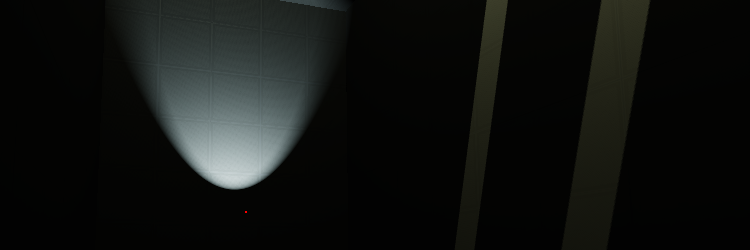
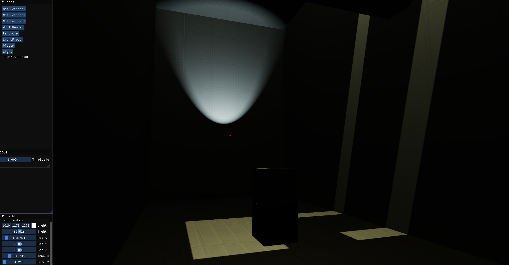
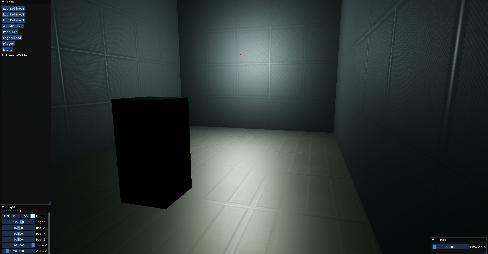
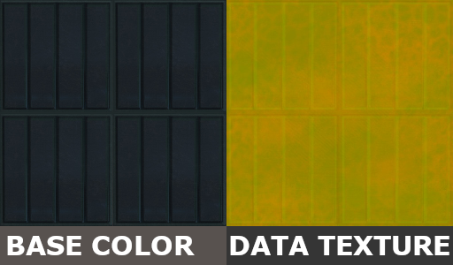

# Readme for the GameEngine 7


***

# Table of Contents
1. [Build (EXE,Release)](#Build)
2. [Project Setup](#ProjectSetup)
3. [TRENCHBROOM MAP BUILDING](#TrenchBroomMapBuilding)
4. [Feature/ todo list](#FeatureList)
5. [Screenshots](#Screenshots)

#### external (`docs/`)
[BasicSetup](docs/BasicSetup.md)\
[Entity Functions](docs/EntityFunctions.md)

# Build

```
mkdir Build
cd Build
cmake ..
cmake --build . --config Release
```

# ProjectSetup

CMakeLists doesn't build OpenAL and puts dll into the Build folder

1. Get Engine Folder or Example Engine7 Project
2. create files EntManager.h,EntUser.h,GameEnt.cpp,GameSubsys.cpp in game folder
3. setup files EntManager.h,EntUser.h,GameEnt.cpp,GameSubsys.cpp, example lower
4. add "texture", "shaders" folder to Build folder
5. "texture" folder must contain "textures.ini", example lower
6. "texture" folder must contain your textures
7. "shaders" folder must contain your shaders (Vertex,Fragment)

---

8. Compile OpenAL (openal-soft), guides can be found online
9. paste OpenAl32.dll file into the Build folder
10. if not taken from the example, copy basic engine code to "main.cpp"

Engine project **should** build

##### IMPORTANT : for engine to launch, OpenAl32.dll should be present

### For engine to work, copy example code into specified files
**code is in the docs/BasicSetup.md**
`docs/BasicSetup.md` also contains file structure

---

---

## Entity Functions can be found at `docs/EntityFunctions.md`

---
# TrenchBroomMapBuilding

**this step needs 2 files**
* .map
* .obj

to get obj use export>Wavefront OBJ...\
pass 2 files with "textures.ini"\
save is built into a function so map can be loaded faster with "gems" format\
example:
`Game.CompileTrenchBroomMap("PipeMap.obj","PipeMap.map","saves/test1.gems","textures/textures.ini");`

### what is .GEMS ?

`.gems` is a compiled map for engine7.\
`.gem` was a map format that stores Brushes and Entity data in binary

`.gems` was made more flexible, for any type of entity. (data isn't constrained to 64 bytes)\
by passing only `.gems` engine needs less time to load a level compared to `.map` or `.obj`

#### Format structure

1. int BrushN | Brush Number in a level
2. Brushes | (slightly compressed. Unused sides removed)
3. unsigned int EntN | Ent Number
4. every entity DEBUG name (64 bytes)
5. entity custom data. any format. Use Save Load function for that.


.gems can be built from `.map` AND `.obj` AT THE SAME TIME


---

# FeatureList

### DONE
* scripting with classes
* lighting system (point,spot)
* collisions
* world raycast
* particle system
* mappable keys
* level loading/saving (quick save/load)
* PBR
* Flood Light (with shadows)
* trenchbroom map loading and saving (obj,.map)
* _level loading_
* GUI (ImGUI)
* audio
* player controller (DEMO)
### WORKING ON
### TODO

* static prop creation,compilation  **[CANCELED]**
* GUI   **[CANCELED]**


# Screenshots

#### Full Engine Window

#### Full Engine Window (point light ONLY)


#### Texture example

RED - metallic(0-1) | GREEN - roughness(0-1) or shininess